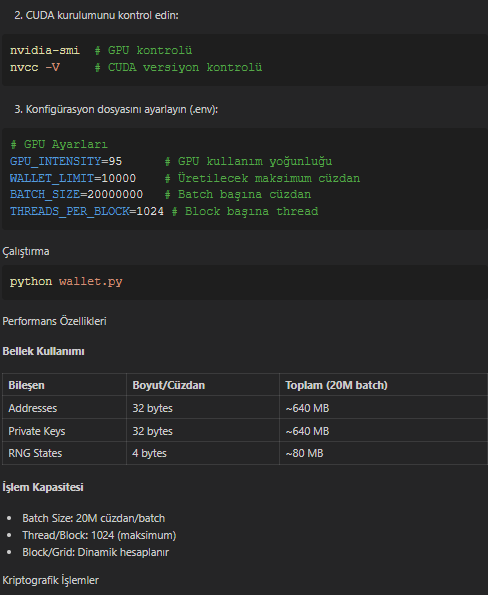
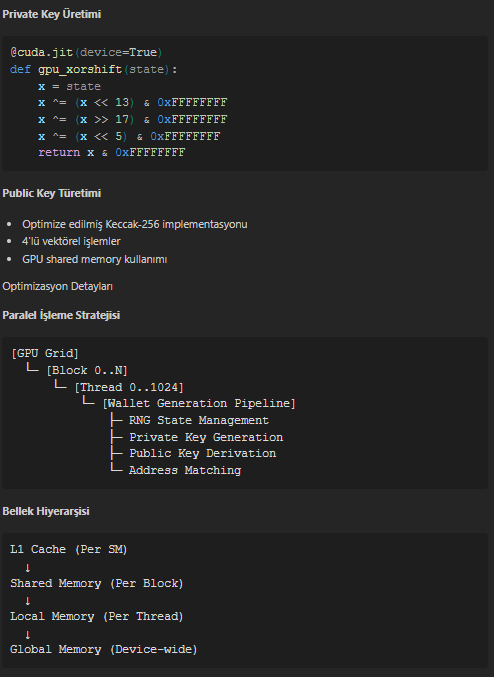
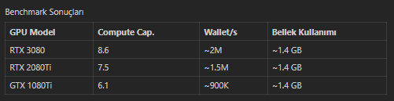
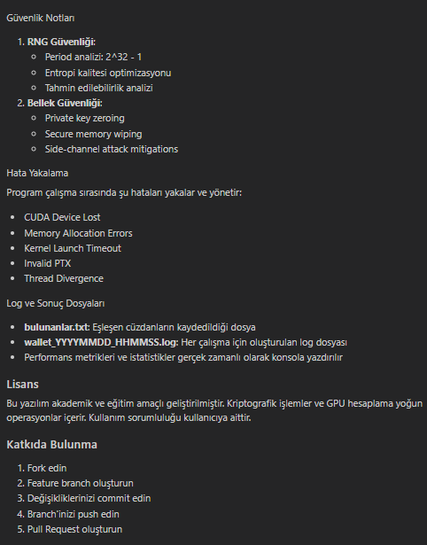

# CUDA GPU Accelerated Ethereum Wallet Generator & Finder

A high-performance tool that leverages CUDA GPU acceleration to generate and search for Ethereum wallets. This application utilizes parallel processing capabilities of NVIDIA GPUs to significantly speed up the process of generating Ethereum addresses and finding specific patterns or matches.

## Features
- CUDA-based GPU acceleration
- Ethereum wallet generation
- Pattern matching capabilities
- High throughput processing
- Support for multiple GPUs

## Prerequisites
- NVIDIA GPU with CUDA support
- CUDA Toolkit installed
- C++ compiler
- CMake (for building)

## Technical Architecture

### System Architecture

- **CUDA Kernel Pipeline**:
    - Creating wallet candidate pool on Host (CPU)
    - Data transfer to Device (GPU)
    - Parallel key generation and validation with CUDA kernel
    - Transfer of results back to host
    - Balance checks via Web3 API

- **Parallel Processing Layers**:
    - Grid level parallelization
    - Block level work distribution
    - Thread level computation
    - Warp based synchronization

- **Data Flow**:
    - Random seed generation
    - Private key derivation
    - Public key calculation
    - Ethereum address generation
    - Balance check and validation

- **Memory Hierarchy**:
    - Host memory -> Device memory transfer
    - Global memory -> Shared memory optimization
    - Register usage
    - L1/L2 cache strategies

A flowchart showing the workflow:
```
[Host] --> Seed Pool --> [Device] --> CUDA Kernels
     ^                                     |
     |                                     v
Results <-- Verification <-- Candidate Wallets <-
```

### CUDA Kernel Optimizations
- Shared memory usage for L1/L2 cache optimization
- Thread-level parallelism (TLP) maximization
- Loop unrolling for instruction-level parallelism (ILP)
- Warp divergence minimization
- Coalesced memory access patterns
- Atomic operation optimizations

### Memory Management
- Zero-copy buffer usage
- Pinned host memory implementation
- Stride-aligned memory access
- Device memory hierarchy optimization:
  - Global memory
  - Shared memory
  - Local memory (in registers)

### System Requirements

#### Hardware
- NVIDIA GPU (Compute Capability ≥ 6.0)
- Minimum 2GB VRAM
- PCIe 3.0 x16 recommended

#### Software
- CUDA Toolkit 11.0+
- Python 3.8+
- Numba 0.56+
- NumPy 1.20+

### Installation

1. Install Python dependencies:
```bash
pip install -r requirements.txt
```

2. Install CUDA Toolkit:
- Download and install CUDA Toolkit 11.0+
- Configure CUDA environment variables

3. Install Node.js dependencies:
```bash
npm install
```

4. Get Infura API key:
- Create a free account at https://infura.io
- Create a new project
- Copy the Project ID
- Replace `YOUR-PROJECT-ID` in `eth_finder.js` with the copied Project ID

## Usage

Run in normal mode:
```bash
node eth_finder.js
```

Run in test mode:
```bash
node eth_finder.js --test
```

Run with a different output file:
```bash
node eth_finder.js --output results.json
```

Change the number of threads:
```bash
node eth_finder.js --threads 8
```

## Notes

- No real balance checks are performed in test mode
- Results are saved to `wallets.json` by default
- A new log file is created for each scan (wallet_scan_YYYYMMDD_HHMMSS.log)
- The log file contains addresses, seed phrases, and balances of all wallets
- There is a 0.1-second delay between each request due to rate limiting






All technical details, installation steps, optimizations, and usage information are combined into a single comprehensive README file.
